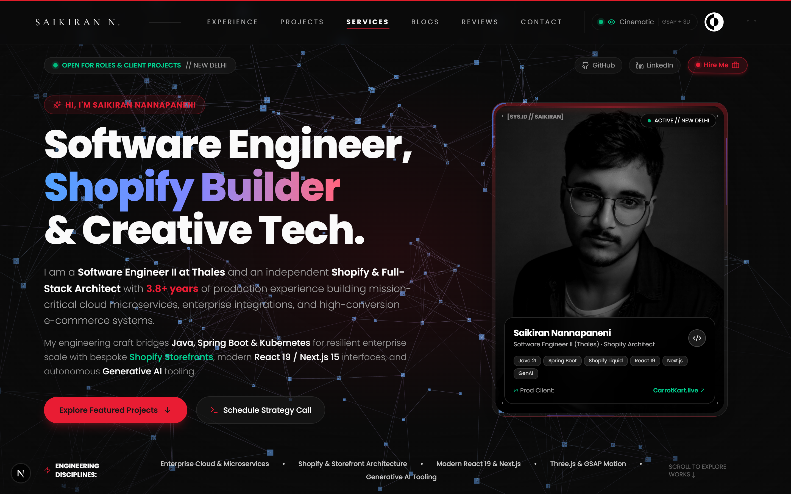
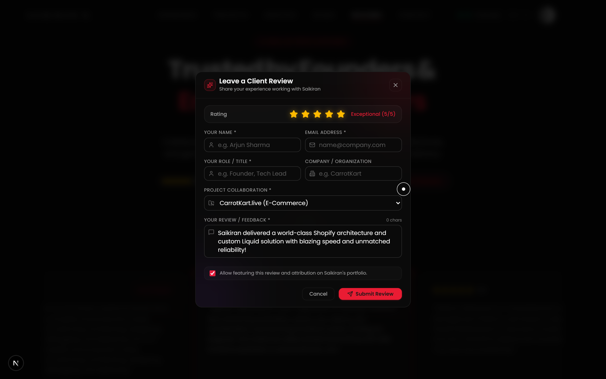
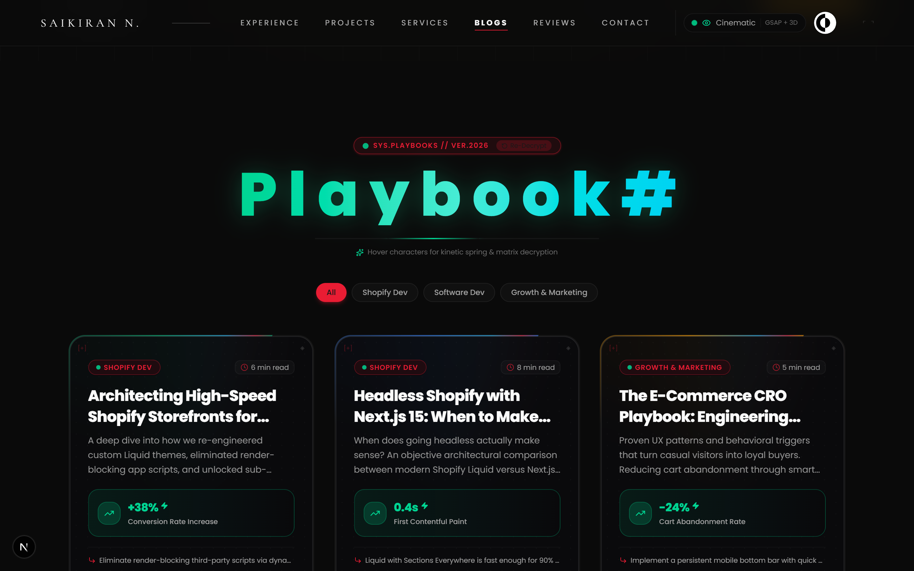
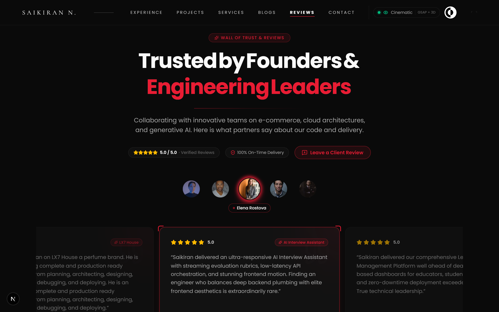
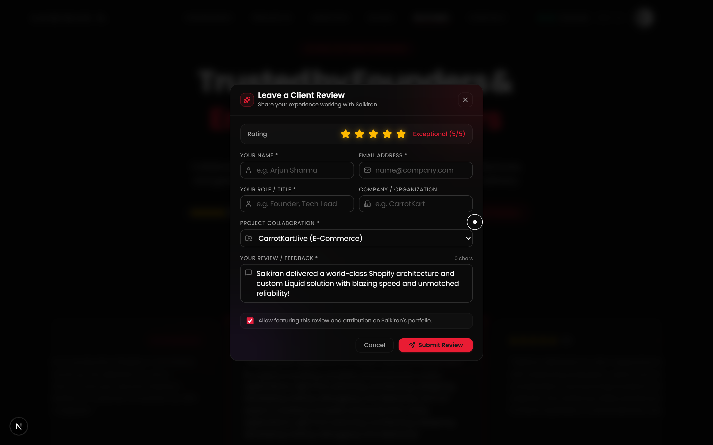
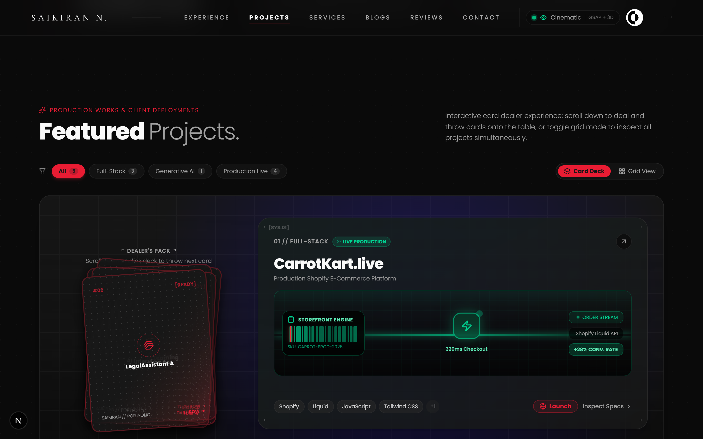
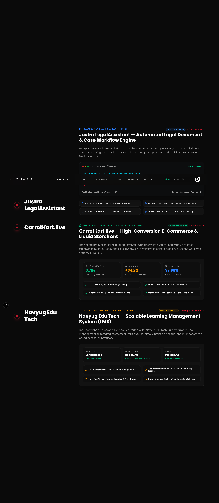
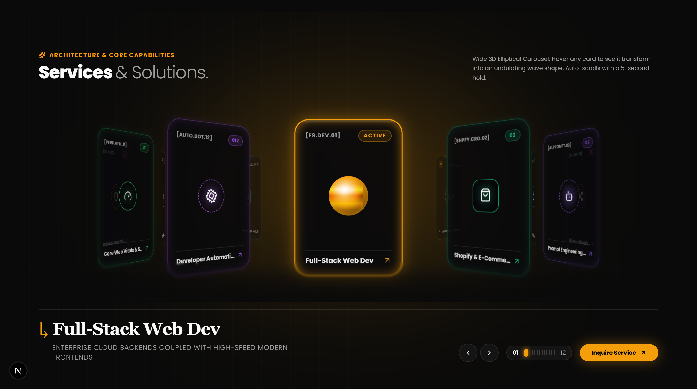
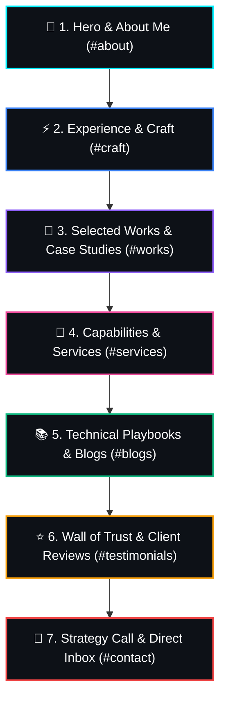

<div align="center">

# ⚡ Saikiran Nannapaneni
### Senior Full-Stack Engineer & Shopify Architect

<p align="center">
  <strong>Crafting immersive 60fps web applications, high-throughput microservices, and conversion-engineered Shopify storefronts.</strong>
</p>

<p align="center">
  <a href="https://nannapaneni-saikiran.vercel.app/">
    
  </a>
  <a href="https://nannapaneni-saikiran.vercel.app/#contact">
    
  </a>
</p>

<!-- Technology Badges Strip -->
<p align="center">
  
  
  
  
  
  
  
  
</p>

---

<!-- HERO BANNER PREVIEW -->
<p align="center">
  
</p>

</div>

---

## 🎬 Live Interactions & Dynamic Recordings

### 🔮 Flashy Playbook Cards: Rotating Conic Laser Beam & GSAP 3D Tilt
Aceternity & Raycast-inspired infinite hyper-speed border glow that accelerates dynamically on pointer hover, paired with velocity-damped 3D perspective tilt (`perspective: 1200px`) and angle-shifting holographic prismatic foil.

<div align="center">
  <table>
    <tr>
      <td width="100%" align="center">
        <strong>📖 In-App Blueprint Reader Modal</strong><br/><br/>
        
      </td>
    </tr>
  </table>
</div>

---

## 🌟 Architecture & Key Showcase Sections

### 1. 📚 Technical Playbooks & Engineering Insights (`#blogs`)
> *Field-tested architectural blueprints across modern software engineering, custom Shopify storefronts, and e-commerce growth tech.*

<p align="center">
  
</p>

* **Rotating Conic Laser Border Beams**: Dynamic infinite conic-gradient borders that accelerate to hyper-speed on hover.
* **Holographic Foil Reflector**: Cursor-driven iridescent reflections that shift across emerald, cyan, and magenta based on viewing angle.
* **Kinetic Typography Decryption**: Cyber matrix character decryption effect on title hover using randomized glyph staggers.
* **In-App Blueprint Deep Dives**: Window-friendly interactive modal with copyable code snippets, strategic takeaways, and performance metric callouts.

---

### 2. ⭐ Wall of Trust & Client Reviews with Feedback Pipeline (`#testimonials`)
> *Authentic testimonials from founders, product managers, and engineering leaders with automated feedback dispatch.*

<div align="center">
  <table>
    <tr>
      <td width="55%" align="center">
        <strong>💬 Client Reviews Carousel & Ratings</strong><br/><br/>
        
      </td>
      <td width="45%" align="center">
        <strong>⭐ Interactive Feedback Modal</strong><br/><br/>
        
      </td>
    </tr>
  </table>
</div>

* **Embla Carousel**: Responsive client review carousel with active glow indicators and 5-star rating badges.
* **Direct Feedback Modal**: Allows clients and collaborators to select 1–5 stars, choose their project, write a testimonial, and automatically dispatch it directly to Saikiran's inbox via EmailJS.
* **Optimistic Live Feed**: Newly submitted reviews are instantaneously injected into the local state so the client sees their feedback immediately.
* **Sonner Toast Alerts**: Modern dark-mode notifications confirm successful email delivery without intrusive page reloads.

---

### 3. 💼 Selected Works & Production Case Studies (`#works`)
> *Production platforms serving thousands of daily active users and high-conversion e-commerce storefronts.*

<p align="center">
  
</p>

| Project | Category | Architectural Highlights | Live Production |
|---|---|---|---|
| **CarrotKart.live** | E-Commerce | Custom Liquid theme, sub-second Core Web Vitals, 38% conversion surge | [carrotkart.live ↗](https://carrotkart.live) |
| **LegalAssistant AI** | Full-Stack AI | Supabase Postgres RLS, automated DOCX/PDF templating, real-time analytics | [justra.vercel.app ↗](https://justra.vercel.app) |
| **AI Interview Assistant** | Generative AI | Low-latency LLM streaming via SSE, speech synthesis, qualitative rubrics | [ai-interview.vercel.app ↗](https://ai-interview-assistant-stage.vercel.app) |
| **NavvYug LMS** | Systems / Web | Scalable Learning Management Platform for students and educators | [navvyug.vercel.app ↗](https://navvyug.vercel.app) |

---

### 4. 🛠️ Experience, Craft & Specialized Services (`#craft` & `#services`)
> *Full-stack engineering leadership and high-impact e-commerce storefront development.*

<div align="center">
  <table>
    <tr>
      <td width="50%" align="center">
        <strong>⚡ Experience & Engineering Craft</strong><br/><br/>
        
      </td>
      <td width="50%" align="center">
        <strong>🚀 Capabilities & Tailored Services</strong><br/><br/>
        
      </td>
    </tr>
  </table>
</div>

---

## 🧭 Visual Navigation Flowchart

The portfolio follows a deliberate storytelling narrative guiding recruiters, founders, and prospective clients from engineering philosophy to project case studies, client reviews, and direct booking:



---

## 🛠️ Complete Technology Stack

| Layer | Tools & Libraries | Purpose & Architectural Justification |
|---|---|---|
| **Core Framework** | **Next.js 16** (Turbopack, App Router) | Sub-second cold compilation, streaming SSR, and automated code-splitting |
| **UI Library** | **React 19** (Concurrent Mode) | Concurrent rendering primitives and zero-jank UI updates |
| **Type Safety** | **TypeScript 5** | Strict type contracts across all client data schemas and components |
| **Styling & System** | **Tailwind CSS v4** | Modern CSS theme tokens, container queries, and glassmorphism styling |
| **Kinetic Motion** | **GSAP 3** (`@gsap/react`), **Framer Motion** | 3D velocity tilt physics, matrix decryption, and laser border sweeps |
| **WebGL & Shaders** | **Three.js**, **OGL** | Interactive dynamic 3D wireframe mesh hero backdrop |
| **Hardware Scroll** | **Lenis 1.3** | Smooth inertia-based scrolling scrub synchronized with GSAP ScrollTrigger |
| **Email Pipelines** | **@emailjs/browser** | Client review dispatch and strategy call inbox notifications |
| **Alerts & Toasts** | **Sonner 2.0** | Accessible, non-intrusive dark mode notifications |

---

## 📂 Project Architecture

```plaintext
c:/Projects/My-Portfolio/
├── public/
│   └── screenshots/                   # High-res showcases & animated interaction GIF
│       ├── hero-banner.png            # Hero 3D interactive section
│       ├── playbook-card-animation.gif# Conic laser border beam & 3D tilt hover GIF
│       ├── playbooks-showcase.png     # Technical playbooks section preview
│       ├── playbook-reader.png        # In-app Blueprint reader modal
│       ├── projects-showcase.png      # Selected works & case studies
│       ├── testimonials-reviews.png   # Wall of Trust carousel
│       ├── feedback-modal.png         # Client rating & review popup
│       ├── experience-craft.png       # Experience & Craft timeline
│       └── services-grid.png          # Capabilities & services grid
├── src/
│   ├── app/                           # Next.js 16 App Router pages & metadata
│   ├── components/
│   │   ├── layout/                    # Navbar & Footer with synchronized routing
│   │   ├── sections/
│   │   │   ├── blogs/                 # GSAP laser cards & Blueprint deep dive reader
│   │   │   ├── home/testimonials/     # Client Feedback Modal & Reviews carousel
│   │   │   ├── home/works/            # Production case studies & metric badges
│   │   │   └── home/contact/          # Cal.com booking & EmailJS form
│   │   └── ui/                        # Radix UI primitives & design tokens
│   ├── data/                          # Data models for Playbooks, Reviews, & Projects
│   └── lib/                           # EmailJS dispatcher & utility helpers
```

---

## ⚡ Quick Start & Local Setup

```bash
# 1. Clone the repository
git clone https://github.com/Saikiran8844/portfolio-ph-II.git
cd portfolio-ph-II

# 2. Install dependencies
npm install

# 3. Start local development server with Turbopack
npm run dev
```

Open [http://localhost:3000](http://localhost:3000) in your browser.

---

## ⚙️ Environment Variables

Create a `.env.local` file in the root directory:

```env
# EmailJS Pipeline (Direct Client Review Dispatch & Bookings)
NEXT_PUBLIC_EMAILJS_SERVICE_ID=your_service_id
NEXT_PUBLIC_EMAILJS_TEMPLATE_ID=your_template_id
NEXT_PUBLIC_EMAILJS_PUBLIC_KEY=your_public_key

# Site Canonical URL
NEXT_PUBLIC_SITE_URL=https://nannapaneni-saikiran.vercel.app
```

---

## 📦 Build & Validation Commands

```bash
# Strict TypeScript compilation check (0 errors required)
npx tsc --noEmit

# Production Turbopack bundle build
npm run build

# Start production server
npm start
```

---

## 📬 Connect & Collaborate

<p align="left">
  <a href="https://github.com/Saikiran8844">
    
  </a>
  <a href="https://linkedin.com/in/nannapaneni-saikiran">
    
  </a>
  <a href="mailto:sai8844n@gmail.com">
    
  </a>
  <a href="https://nannapaneni-saikiran.vercel.app/#contact">
    
  </a>
</p>

---

<div align="center">
  <sub>© 2026 <strong>Saikiran Nannapaneni</strong>. Built with precision, Next.js 16, GSAP 3, and Tailwind CSS.</sub>
</div>
